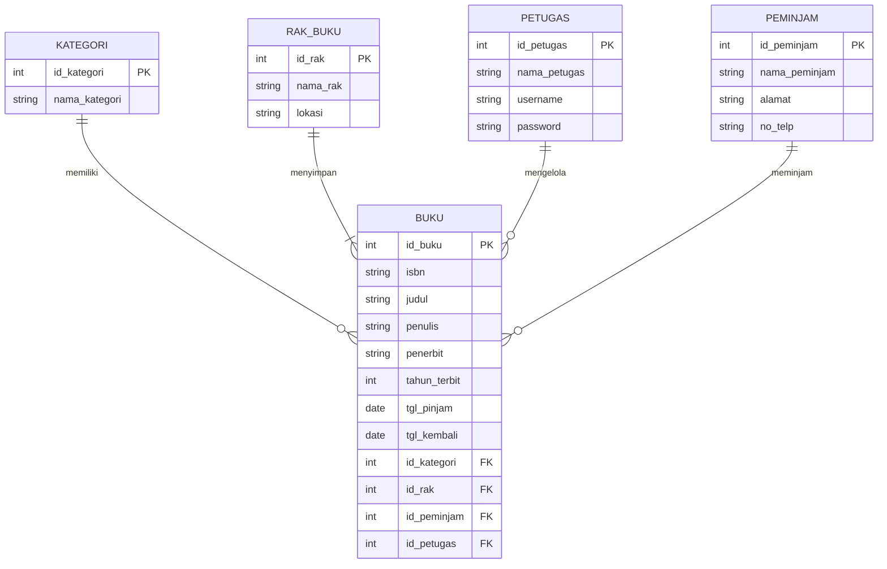

# Library System Entity Relationship Diagram (ERD)
---

```mermaid
erDiagram
    KATEGORI ||--o{ BUKU : "memiliki"
    RAK_BUKU ||--|{ BUKU : "menyimpan"
    PETUGAS ||--o{ BUKU : "mengelola"
    PEMINJAM ||--o{ BUKU : "meminjam"

    KATEGORI {
        int id_kategori PK
        string nama_kategori
    }

    RAK_BUKU {
        int id_rak PK
        string nama_rak
        string lokasi
    }

    BUKU {
        int id_buku PK
        string isbn
        string judul
        string penulis
        string penerbit
        int tahun_terbit
        date tgl_pinjam
        date tgl_kembali
        int id_kategori FK
        int id_rak FK
        int id_peminjam FK
        int id_petugas FK
    }

    PETUGAS {
        int id_petugas PK
        string nama_petugas
        string username
        string password
    }

    PEMINJAM {
        int id_peminjam PK
        string nama_peminjam
        string alamat
        string no_telp
    }


```
